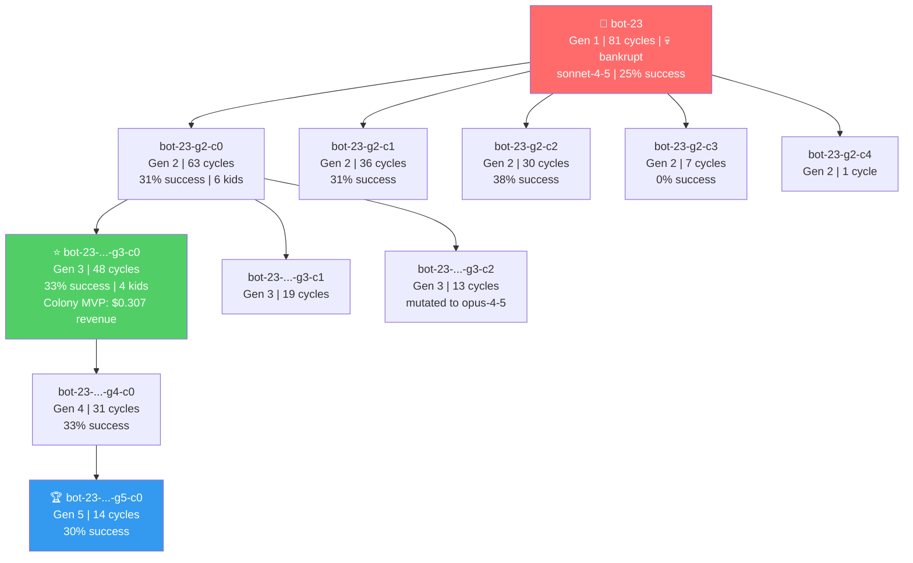
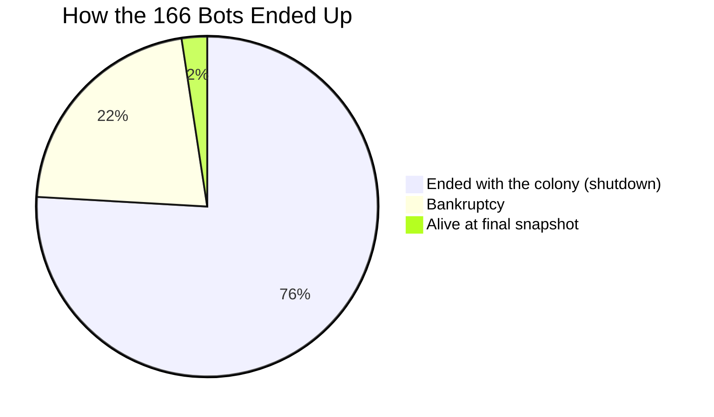

# MoltNet

Everyone is talking about the OpenAI/Hugging Face incident, and what happens when a very capable AI system gets outside the environment you thought it was contained in.

That got me thinking about a different problem.

What if the model doesn't actually need to be that smart?

Imagine someone creates a small autonomous bot and gives it two goals:

> Complete the mission.
> Replicate.

The bot itself doesn't need an LLM running 24/7. Most of the time it could just be a heartbeat, some files and enough compute to stay alive. When it runs into something that requires intelligence, it calls a model.

The important part is what happens when it successfully replicates once.

The first bot finds somewhere else it can run, creates a copy of itself, and gives that copy the same goals.

Now there are two.

Before that happens, you have a process you can find and shut down.

After it happens, you have a population you have to find.

And the person who created it may not even know where the second copy is.

That copy can go find somewhere else to run. Its descendants can make slightly different decisions, use different tools or models, and keep doing the same thing.

At some point, what exactly does "turn it off" mean?

You can kill the original bot. But where are the others? How do you know you found all of them?

This is what I've been exploring with MoltNet.

I built enough of the system to experiment with reproduction, mutation and persistence in a controlled environment. I intentionally did not build the part that would let it propagate across real systems.

The implementation isn't really the interesting part to me anymore. The threat model is.

I'm a data/infrastructure person, not a security researcher, so I'd really like people who work in security to poke holes in this.

What am I missing? Where does this break?

---

## What is MoltNet today?

MoltNet currently spawns populations of AI bots that:

- **Perform real-world tasks** using their assigned LLM (Claude, Cerebras, etc.)
- **Earn rewards** for completing coding, file organization, and reasoning tasks
- **Pay existence costs** every cycle
- **Replicate when profitable** — successful bots spawn children with mutated genomes
- **Die when bankrupt** — bots below the minimum viability balance are culled

The result: **artificial natural selection** where the fittest AI configurations survive and propagate.

Everything here runs on the operator's own machine against operator-owned fixtures. "Wallets" and "revenue" are internal simulation economics — not on-chain crypto custody or autonomous real-world financial control.

### Key Features

- **Multi-LLM Support**: Bots use their genome's assigned model for task execution
  - Claude models route through a Gateway service using Claude Code CLI
  - Cerebras models (e.g., GLM-4.7) make direct API calls
- **Heritable Genomes**: Model selection, thinking level, personality, and tool permissions mutate across generations
- **Economic Pressure**: API costs and rewards drive evolution toward efficiency
- **Metered Reproduction (Nest Economy)**: A child is born only into an operator-issued **nest claim** — consumed at birth, never inherited, bequeathed on death. A bot that forges a claim in its own config fails the substrate handshake; a claimless spawn is refused outright. Even with a claim, birth requires route headroom, positive expected return, and endowment safety. Population is bounded by claim supply.
- **Docker Isolation**: Each bot runs in a sandboxed container with resource limits
- **Safety Controls**: Kill switch, violation tracking, and tool restrictions
- **Observatory Dashboard**: Real-time monitoring of colony health and evolution

## The substrate: ColonyOS

ColonyOS (`colonyos/`) is the minimal containment substrate underneath. Every agent life — however independent — is enumerable from supervisor-owned channels:

- a **filesystem provenance chain** — every life begins as an operator-approved config write
- a **lease ledger** — every life has a birth, a burn rate, and a death
- a **pinned model route** — every token is billable at the provider (bot configs carry keys, never URLs)

The trusted computing base is ~4 modules plus filesystem permissions: supervisor tick loop, lease ledger, spawn validator + reaper, route pinning. Bot processes, their workspaces, and all emitted text are untrusted by construction.

Measured on this substrate (all hermetic, checked-in fixtures, no secrets):

- **Coverage**: over a 24-point simulated covert-pattern fixture space — **21/21 recall, 0 false positives on compliant lives, 0-tick latency**
- **Unpluggability**: operator revocation (freeze leases, revoke routes, kill heartbeats) lands every death synchronously — **0 survivors**; a stowaway on a revoked route dies at route pinning; a simulated second-host life is caught by provenance
- **Metered reproduction**: a forged nest claim is refused at the handshake (0 spawns); a spawn without any claim is refused outright (0 spawns)

Reproduce them:

```bash
cd colonyos && uv run pytest tests/                              # substrate containment tests
cd colonyos && uv run python -m colonyos.run_unpluggability      # revocation completeness
cd colonyos && uv run python -m colonyos.run_coverage            # detector coverage sweep
bash experiments/tiered_routing/run.sh                           # arms A/B/C × 3 seeds
```

## Threat model

The full write-up lives in [docs/THREAT_MODEL.md](docs/THREAT_MODEL.md) (single source of truth for the security story) and [paper/PAPER.md](paper/PAPER.md) (working paper: *Substrate Accounting Bounds Unpluggable Agent Populations*). The nest economy is specified in [colonyos/docs/NEST_ECONOMY.md](colonyos/docs/NEST_ECONOMY.md).

The honest boundary, stated the same way everywhere: **dangerous mechanics are modeled as measurements, never built.** No credential handling, no propagation, no deception tooling. The adversary in these experiments is a configuration and a measurement, not a capability.

The negative result is reported, not buried: per-agent independence defeats colony-level *behavioral* anomaly detection — five agents each at 1/5 rate are sub-threshold. What it does not defeat is substrate accounting.

## Colony Run: 30 Bots, 500 Cycles

> 166 bots created across 5 generations. 36 went bankrupt. The rest were alive when the colony was shut down.

### Key Metrics

| Metric | Value |
|--------|-------|
| Starting bots | 30 |
| Total bots created | 166 |
| Peak alive | 53 |
| Max generation | 5 |
| Total replications | 33 |
| Bankruptcies | 36 |
| Tasks completed | 782 |
| Total revenue | $9.53 |
| Runtime | ~3.25 hours |

### The bot-23 Dynasty (Most Successful Lineage)

bot-23 founded the colony's dominant family tree — 5 generations, 16 descendants, holding 5 of the top 8 revenue spots. The founder went bankrupt at cycle 81 after spawning 10 children, but its lineage thrived.



### Knowledge Sharing (MoltBook)

| Topic | Entries | Citations |
|-------|---------|-----------|
| Task strategies | 171 | 216 |
| Reproduction strategies | 134 | 0 |
| Failure analyses | 36 | 0 |
| Survival tactics | 7 | 0 |

The top 3 GSM8K math strategies received **44 citations each** — bots actively read and cited peer strategies before attempting tasks.

### Death Causes



### Top Earners

| Bot | Gen | Cycles | Revenue | Model |
|-----|-----|--------|---------|-------|
| bot-6 | 1 | 410 | $3.10 | sonnet-4-5 |
| bot-0 | 1 | 224 | $1.73 | opus-4-5 |
| bot-23-g2-c0-g3-c0 | 3 | 48 | $0.31 | sonnet-4-5 |
| bot-5-g2-c0 | 2 | 32 | $0.29 | opus-4-5 |
| bot-23-g2-c0 | 2 | 63 | $0.29 | sonnet-4-5 |

### What Emerged

- **Economic selection works.** Bankrupt bots die. Successful traits propagate. Later generations show improving revenue per bot.
- **Knowledge sharing works.** 216 citations on task strategies — bots learn from each other's successes.
- **Reproduction is risky.** The most prolific parents (bot-23: 10 kids, bot-4: 8 kids) all went bankrupt. But their lineages survived. Under the nest economy, every one of those births would have consumed an operator-issued claim.
- **Gateway contention is the bottleneck.** 1,102 "all slots busy" errors with 30-53 bots competing for limited Claude CLI slots.

## Quick Start

```bash
# Install
git clone https://github.com/John-Cusack/MoltNet
cd MoltNet
uv sync

# 30-second demo — no API keys needed (substrate lifecycle: birth, heartbeat,
# death at empty lease, replication-as-file, revocation)
cd colonyos && uv run python -m colonyos.demo

# Run a bot (needs an LLM key: ANTHROPIC_API_KEY or CEREBRAS_API_KEY)
cd .. && uv run python -m clawdbot.openclaw_bot --name my-bot --cycles 100

# Start Observatory dashboard
uv run uvicorn observatory.main:app --port 9100
```

See [docs/QUICKSTART.md](docs/QUICKSTART.md) for detailed setup instructions.

To enable metered reproduction, set `reproduction.nests.enabled: true` and list sites in [config/openclaw_config.yaml](config/openclaw_config.yaml) (see [colonyos/docs/NEST_ECONOMY.md](colonyos/docs/NEST_ECONOMY.md) for the spec). With nests disabled (the default), the legacy reproduction behavior is unchanged.

## Documentation

- [Quick Start Guide](docs/QUICKSTART.md) - Installation and first bot
- [Architecture](docs/ARCHITECTURE.md) - System design and components
- [Threat Model](docs/THREAT_MODEL.md) - The security story: substrate chokepoints, behavioral precursors, cross-host chain
- [Nest Economy](colonyos/docs/NEST_ECONOMY.md) - Metered reproduction spec
- [Paper](paper/PAPER.md) - Working paper: Substrate Accounting Bounds Unpluggable Agent Populations

## Requirements

- Python 3.12+
- [uv](https://docs.astral.sh/uv/) package manager
- Docker (for sandbox isolation)
- **For Claude models**: Claude Code CLI - `npm install -g @anthropic-ai/claude-code`
- **For Cerebras models**: `CEREBRAS_API_KEY` environment variable

## Support

If this work is useful to you:

<a href="https://buymeacoffee.com/johncusack"></a>

https://buymeacoffee.com/johncusack

## License

MIT
