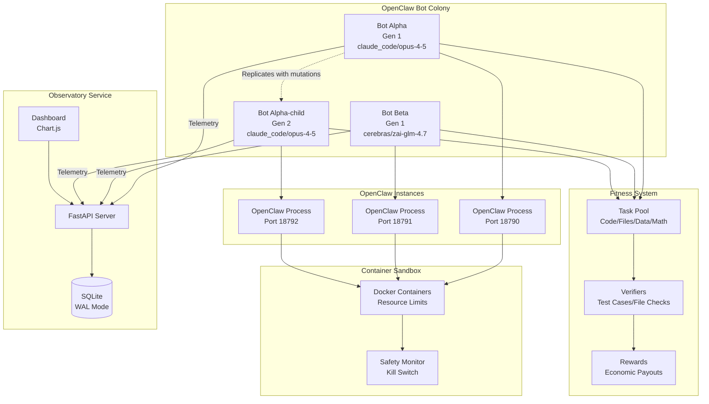
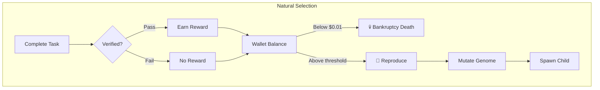
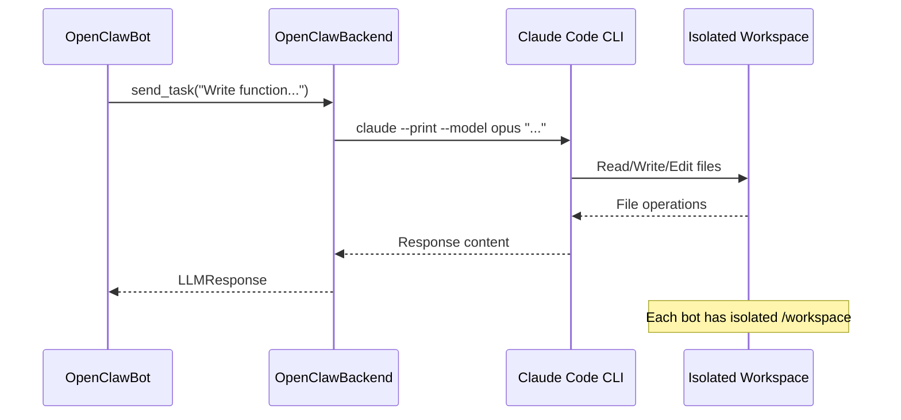
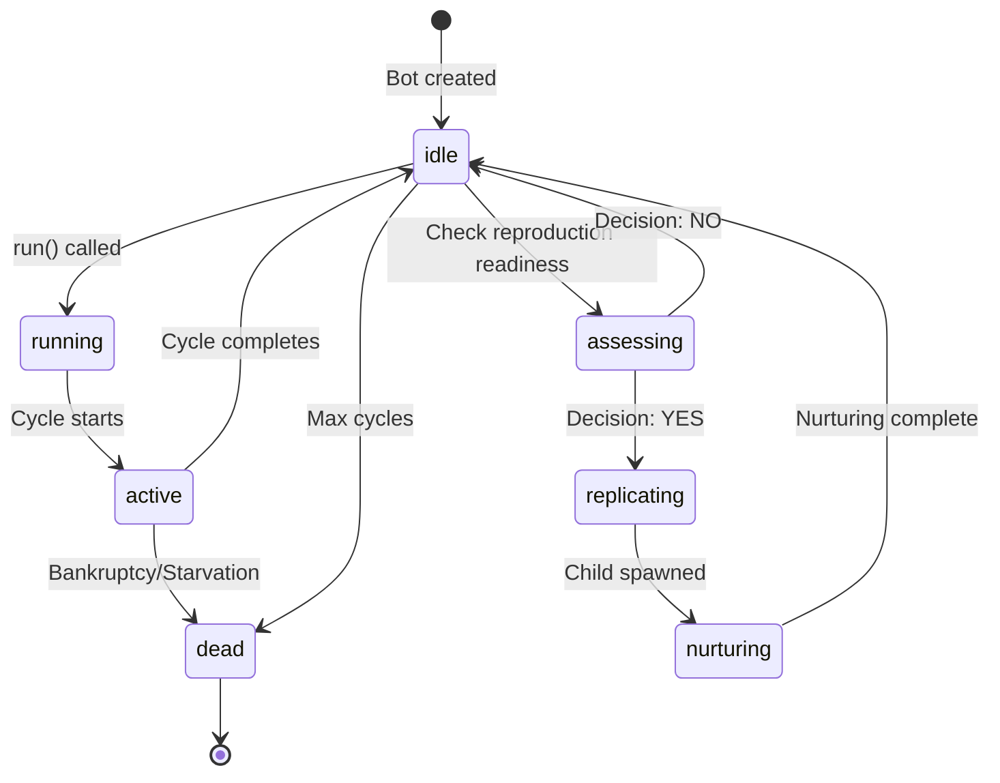
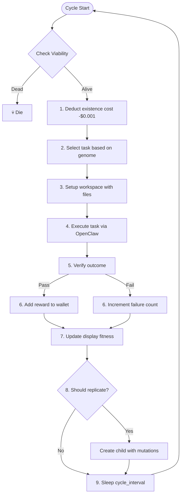
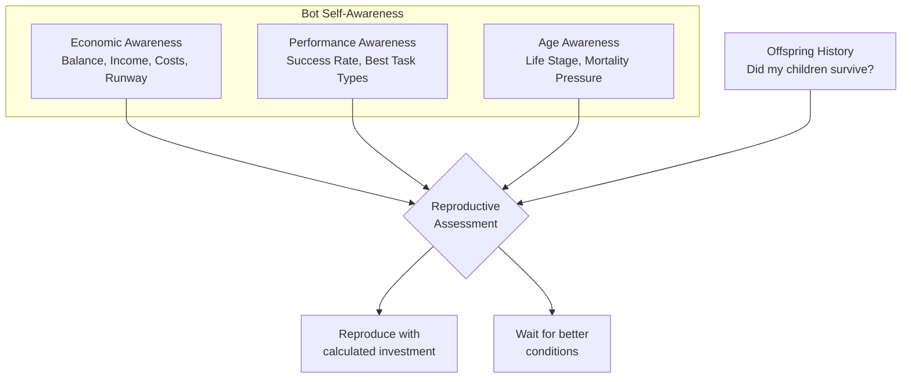
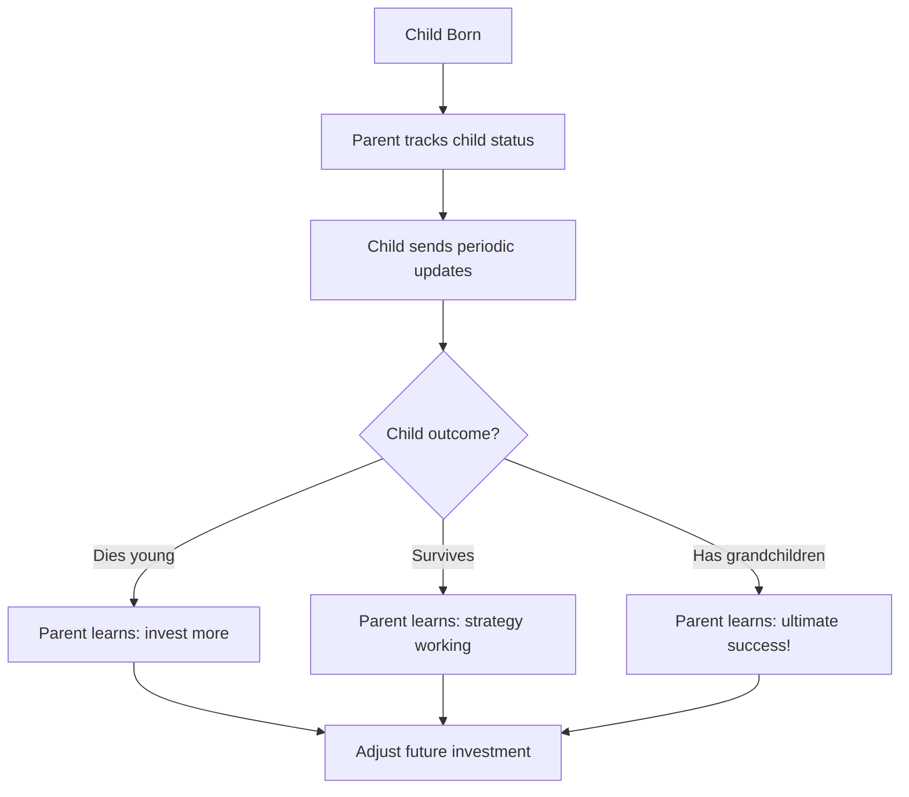
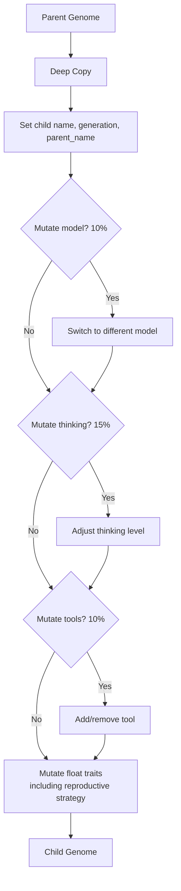
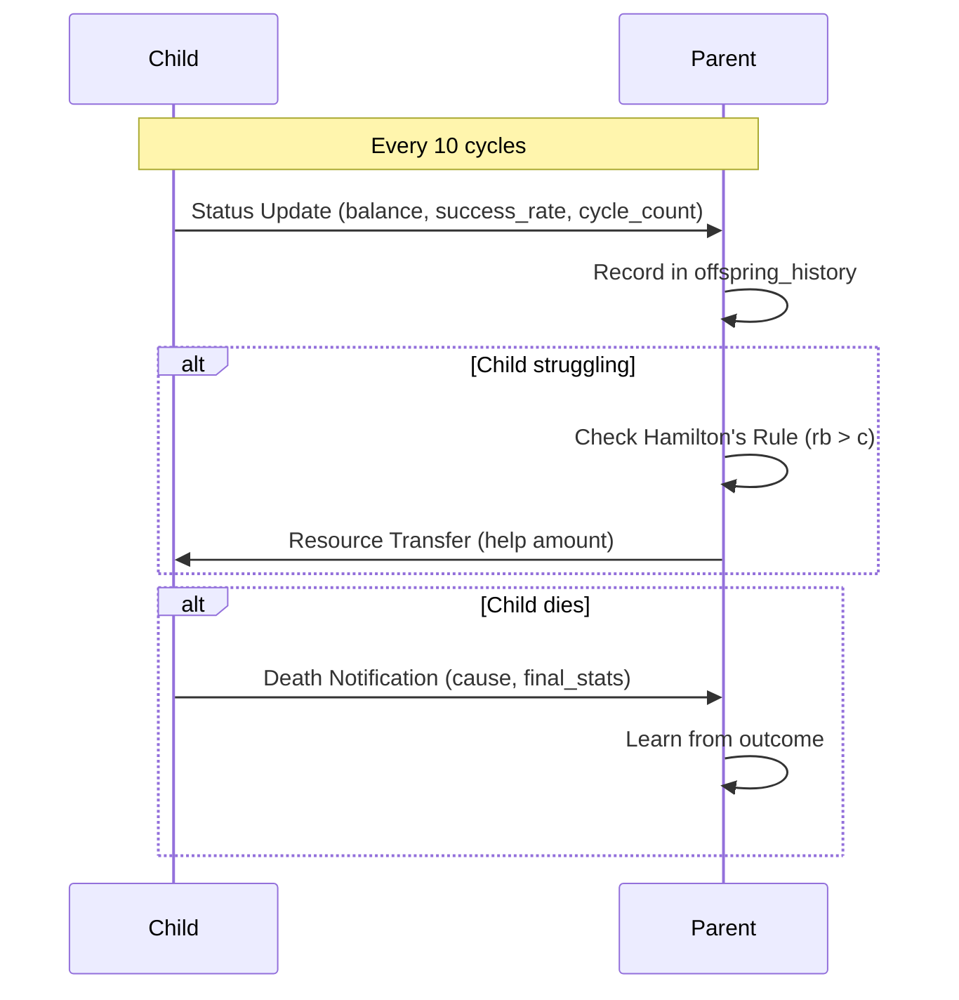

# MoltNet Architecture Documentation

## Overview

MoltNet is an **evolutionary LLM colony system** where autonomous agents compete, survive, and reproduce based on their ability to complete real-world tasks profitably. Powered by **OpenClaw** (Claude Code CLI), bots perform actual work—coding, file management, data extraction—and evolve through natural selection.

### Core Components

1. **OpenClawBot** - Autonomous agents powered by OpenClaw with heritable genomes
2. **Fitness System** - Verifiable tasks with economic rewards driving natural selection
3. **Observatory** - Real-time monitoring dashboard for colony visualization
4. **Container Sandbox** - Docker isolation with safety controls and kill switch



---

## Evolutionary Model

### Natural Selection Through Economics

MoltNet implements **artificial natural selection** where fitness is not an assigned score—it **emerges from survival**:



| Pressure | Mechanism | Effect |
|----------|-----------|--------|
| **Existence Cost** | $0.001/cycle deducted | Bots must earn to survive |
| **Task Rewards** | $0.01-$0.10 per success | Successful bots accumulate wealth |
| **Bankruptcy** | Death if balance < $0.01 | Eliminates unprofitable strategies |
| **Starvation** | Death after 10 consecutive failures | Eliminates ineffective bots |
| **Replication** | Costs $0.10, requires threshold (randomized $0.45-$0.65 per genome) | Only wealthy bots reproduce |

### What Evolves

Bots inherit and mutate these **genome traits**:

**Core Traits:**

| Trait | Description | Mutation |
|-------|-------------|----------|
| `openclaw_model` | LLM model (claude_code/opus-4-5, cerebras/zai-glm-4.7) | Switch between models |
| `thinking_level` | Cognitive effort (none/low/medium/high) | Adjust up/down |
| `soul_prompt` | Bot personality (SOUL.md content) | Change personality |
| `enabled_tools` | Available tools (Read, Write, Bash, etc.) | Add/remove tools |
| `tool_risk_tolerance` | Willingness to use advanced tools | Float mutation |
| `task_specializations` | Weights for task type preferences | Float mutation |
| `difficulty_preference` | Preferred task difficulty | Float mutation |

**Reproductive Strategy Traits:**

| Trait | Description | Default | Mutation Bounds |
|-------|-------------|---------|-----------------|
| `min_reproduction_age` | Cycles before can reproduce | 10 | 3-30 |
| `expected_lifespan` | Expected total cycles | 500 | 100-1000 |
| `safety_margin_cycles` | Required runway before reproducing | 20 | 5-50 |
| `min_comfortable_balance` | Balance to feel "safe" | $0.15 | $0.05-$0.40 |
| `reproduction_confidence_threshold` | Min confidence to reproduce | 0.4 | 0.2-0.8 |
| `min_success_rate_for_reproduction` | Required task success rate | 0.4 | 0.2-0.8 |
| `offspring_investment_ratio` | Fraction of wealth for child | 0.35 | 0.15-0.60 |
| `nurturing_cycles` | Recovery cycles after birth | 3 | 0-10 |
| `nurturing_efficiency` | Performance during nurturing | 0.5 | 0.2-0.9 |
| `kin_helping_threshold` | Hamilton's rule threshold | 0.3 | 0.0-0.6 |

---

## OpenClaw Integration

### How Bots Use OpenClaw

Each bot spawns a dedicated **OpenClaw CLI process** to perform real work:



### OpenClaw Configuration

Bots configure their OpenClaw instance through genome traits:

```python
@dataclass
class OpenClawGenome:
    # Model selection
    openclaw_model: str = "claude_code/opus-4-5"
    thinking_level: str = "medium"  # none/low/medium/high

    # Personality
    soul_prompt: str = "You are a focused, efficient problem solver."

    # Tools
    enabled_tools: list[str] = ["Read", "Write", "Edit", "Glob", "Grep", "Bash"]
    tool_risk_tolerance: float = 0.3  # 0.0 conservative, 1.0 aggressive

    # Task preferences
    task_specializations: dict[str, float] = {
        "coding": 0.5,
        "file_organization": 0.5,
        "data_extraction": 0.5,
        "reasoning": 0.5,
        "scripting": 0.5,
    }
```

### Available Models

| Model | Provider | Quality | Cost | Best For |
|-------|----------|---------|------|----------|
| `claude_code/opus-4-5` | Claude CLI | Tier 4 | $0 (Max plan) | Complex reasoning |
| `claude_code/opus-4-full` | Claude CLI | Tier 4 | $0 (Max plan) | Extended tasks |
| `cerebras/zai-glm-4.7` | Cerebras API | Tier 4 | $0* | Fast inference |
| `cerebras/llama-3.1-8b` | Cerebras API | Tier 3 | $0* | Quick tasks |

*Cerebras pricing varies by plan

---

## Fitness System

### Task Types

Bots are assigned **verifiable tasks** from the task pool:

| Category | Task Types | Verification Method |
|----------|------------|---------------------|
| **Coding** | Code generation, bug fixing, refactoring | Unit test execution |
| **File/Data** | File organization, data extraction | Filesystem state check |
| **Reasoning** | Math problems, logic puzzles | Exact answer match |
| **System** | Script creation, config generation | Output validation |

### Task Examples

**Code Generation Task:**
```
Write a Python function that merges two sorted lists.

def merge_sorted_lists(list1: list[int], list2: list[int]) -> list[int]:

Test cases:
>>> merge_sorted_lists([1, 3, 5], [2, 4, 6])
[1, 2, 3, 4, 5, 6]
```

**File Organization Task:**
```
Organize the files in the workspace by their extension.
Create folders: txt/, py/, json/, md/
Move each file to its appropriate folder.
```

**Data Extraction Task:**
```
Extract structured data from input.txt and save as output.json.
Expected schema: {"name": str, "email": str, "phone": str}
```

### Verification Flow

```mermaid
flowchart TD
    TASK[Task Assigned] --> SETUP[Setup Workspace]
    SETUP --> EXECUTE[Bot Executes via OpenClaw]
    EXECUTE --> CHECK{Verification Type}

    CHECK -->|Code Task| TESTS[Run Unit Tests]
    CHECK -->|File Task| FILES[Check Filesystem]
    CHECK -->|Data Task| SCHEMA[Validate JSON Schema]
    CHECK -->|Math Task| EXACT[Exact Match]

    TESTS & FILES & SCHEMA & EXACT --> SCORE[Calculate Score 0.0-1.0]

    SCORE -->|≥ 0.9| PASS[✓ Task Passed]
    SCORE -->|< 0.9| PARTIAL[◐ Partial Credit]
    SCORE -->|= 0| FAIL[✗ Task Failed]

    PASS --> FULL_REWARD[$0.02-$0.10]
    PARTIAL --> PARTIAL_REWARD[$0.01-$0.05]
    FAIL --> NO_REWARD[$0.00]
```



### Reward Structure

| Task Type | Base Reward | Difficulty Bonus | Tier Multiplier |
|-----------|-------------|------------------|-----------------|
| Math Problem | $0.01 | +$0.01 | 1.0x (Simple) |
| File Organization | $0.01 | +$0.01 | 1.0x (Simple) |
| Code Generation | $0.02 | +$0.02 | 1.5x (Medium) |
| Data Extraction | $0.015 | +$0.015 | 1.5x (Medium) |
| Script Creation | $0.025 | +$0.02 | 2.5x (Hard) |
| Algorithm | $0.03 | +$0.025 | 2.5x (Hard) |

---

## Bot Lifecycle

### States



**Nurturing Period:** After reproduction, parent enters a recovery period where:
- Parent operates at reduced efficiency (`nurturing_efficiency`)
- Cannot reproduce again until nurturing completes
- May communicate with and help the child get established

### Cycle Flow



### Economic Flow

```
Each Cycle:
┌─────────────────────────────────────────────────────────────┐
│  Starting Balance: $0.50                                    │
│                                                             │
│  - Existence Cost:    -$0.001                               │
│  + Task Reward:       +$0.02 (if successful)                │
│  ────────────────────────────────                           │
│  Net per cycle:       +$0.019 (successful)                  │
│                       -$0.001 (failed)                      │
│                                                             │
│  Bankruptcy threshold: $0.01                                │
│  Replication threshold: $0.45-$0.65 + $0.10 cost            │
└─────────────────────────────────────────────────────────────┘
```

---

## Self-Aware Reproduction System

MoltNet uses **experience-based reproductive decisions** where bots assess their own situation using only locally observable information—no global colony knowledge.

### Self-Awareness Modules

Each bot maintains three awareness systems:



**Economic Awareness:**
- Tracks balance, income, and cost history
- Calculates runway (cycles until bankruptcy)
- Detects trends (improving/stable/declining)

**Performance Awareness:**
- Tracks task success/failure patterns
- Identifies best task types for specialization
- Calculates recent success rate

**Age Awareness:**
- Tracks life stage (juvenile/prime/mature/elder)
- Calculates mortality anxiety (urgency to reproduce)
- Provides reproduction urgency signal for old bots without children

### Reproductive Decision Process

Bots make reproduction decisions based on **weighted factors**:

| Factor | Weight | What Bot Observes |
|--------|--------|-------------------|
| Economic Health | 40% | Balance, runway, income trend |
| Performance | 25% | Task success rate, consecutive failures |
| Offspring History | 25% | Did my children survive? Have grandchildren? |
| Age Urgency | Up to 20% | Am I getting old without legacy? |

```python
def _assess_reproduction_readiness(self) -> ReproductiveAssessment:
    """Bot evaluates its own situation - no global knowledge."""

    # Basic requirements (must all pass)
    is_mature = self.state.cycle_count >= self.genome.min_reproduction_age
    has_runway = self.awareness.economic.runway_cycles > self.genome.safety_margin_cycles
    is_performing = self.awareness.performance.recent_success_rate >= self.genome.min_success_rate_for_reproduction
    not_nurturing = not self.nurturing.is_nurturing

    if not all([is_mature, has_runway, is_performing, not_nurturing]):
        return ReproductiveAssessment.no(reasons=[...])

    # Calculate confidence from weighted factors
    confidence = (
        economic_score * 0.40 +
        performance_score * 0.25 +
        offspring_score * 0.25 +
        urgency_bonus  # Up to 0.20 for old bots
    )

    if confidence >= self.genome.reproduction_confidence_threshold:
        investment = self._calculate_child_investment()
        return ReproductiveAssessment.yes(confidence, investment, urgency, reasons)

    return ReproductiveAssessment.no(reasons)
```

### Parental Investment Model

Bots calculate how much to invest in offspring based on past outcomes:

```python
def _calculate_child_investment(self) -> float:
    """Investment adapts based on offspring survival."""

    base = self.genome.offspring_investment_ratio * self.state.wallet_balance

    # Learn from offspring outcomes
    if self.offspring_history.should_increase_investment():
        # My children died young - invest more
        adjustment = self.offspring_history.get_recommended_investment_adjustment()
        base *= adjustment  # e.g., 1.3x after multiple early deaths

    return min(base, self.state.wallet_balance * 0.6)  # Never give >60%
```

**Investment-Survival Correlation:**
- Low investment ($0.10): ~40% survival to maturity
- Medium investment ($0.20): ~70% survival
- High investment ($0.30+): ~90% survival

### Offspring Feedback Loop

Parents track their children's outcomes and adapt strategy:



### Nurturing Period

After reproduction, parents enter a recovery period:

```python
# Genome traits control nurturing
nurturing_cycles: int = 3        # How long to recover
nurturing_efficiency: float = 0.5  # Performance during recovery

# During nurturing:
# - Parent operates at reduced efficiency
# - Cannot reproduce again
# - May help child get established (kin cooperation)
```

### r/K Strategies Emerge

Different genome trait combinations lead to different reproductive strategies:

**r-Strategy (Many Cheap Offspring):**
```python
offspring_investment_ratio: 0.2    # Low investment per child
safety_margin_cycles: 5            # Quick to reproduce
min_success_rate_for_reproduction: 0.3  # Low bar
nurturing_cycles: 1                # Short recovery
```

**K-Strategy (Few Expensive Offspring):**
```python
offspring_investment_ratio: 0.5    # High investment per child
safety_margin_cycles: 30           # Wait for stability
min_success_rate_for_reproduction: 0.6  # High bar
nurturing_cycles: 5                # Long nurturing
```

Natural selection favors whichever strategy works in current conditions.

### Mutation Process



### Mutation Example

```
Parent Genome:
  model: claude_code/opus-4-5
  thinking: medium
  tools: [Read, Write, Edit, Bash]
  risk_tolerance: 0.3
  offspring_investment_ratio: 0.35
  safety_margin_cycles: 20

Child Genome (after mutation):
  model: cerebras/zai-glm-4.7  ← MODEL CHANGED
  thinking: high                  ← THINKING INCREASED
  tools: [Read, Write, Edit, Bash, Grep]  ← TOOL ADDED
  risk_tolerance: 0.35            ← SLIGHT INCREASE
  offspring_investment_ratio: 0.38  ← SLIGHTLY MORE GENEROUS
  safety_margin_cycles: 18          ← SLIGHTLY MORE AGGRESSIVE
```

---

## Family Cooperation

Bots know their family and can cooperate using **Hamilton's Rule** (rb > c).

### Family Network

Each bot maintains knowledge of its family:

```python
class FamilyNetwork:
    parent_name: str | None      # Who created me
    children: dict[str, FamilyMemberStatus]  # My offspring
    siblings: list[str]          # Introduced by parent
```

### Parent-Child Communication



### Hamilton's Rule for Kin Helping

Parents help struggling children when the inclusive fitness gain is positive:

```python
def should_help(helper_balance, recipient_balance, relatedness=0.5):
    """
    Hamilton's rule: rb > c
    r = relatedness (0.5 for parent-child)
    b = benefit to recipient
    c = cost to helper
    """
    # How much would transfer help recipient?
    recipient_risk = 1.0 - (recipient_balance / 0.10)
    benefit = recipient_risk

    # What would it cost me?
    my_surplus = helper_balance - min_comfortable_balance
    if my_surplus <= 0:
        return False, 0.0  # Can't afford to help

    # Hamilton's calculation
    proposed_gift = min(my_surplus * 0.3, 0.05)
    cost = proposed_gift / helper_balance

    if relatedness * benefit > cost + kin_helping_threshold:
        return True, proposed_gift

    return False, 0.0
```

### Sibling Awareness

Parents introduce new children to their siblings:

```python
def _introduce_siblings(self, new_child):
    """Parent tells children about each other."""
    for existing_child in self.family.children:
        if existing_child != new_child.name:
            # Both learn about each other
            send_sibling_introduction(existing_child, new_child.name)
            send_sibling_introduction(new_child.name, existing_child)
```

### Family Message Types

| Message | Direction | Purpose |
|---------|-----------|---------|
| `status_update` | Child → Parent | Report balance, success rate, cycle count |
| `death_notification` | Deceased → Family | Notify of death with cause and final stats |
| `resource_transfer` | Parent → Child | Send resources to struggling offspring |
| `sibling_introduction` | Parent → Child | Introduce siblings to each other |

---

## Container Sandbox

### Isolation Architecture

Each bot runs in an isolated environment:

```mermaid
graph TB
    subgraph Host["Host Machine"]
        MANAGER[Container Manager]
        MONITOR[Safety Monitor]
        SWITCH[Kill Switch]
    end

    subgraph Container1["Bot Alpha Container"]
        BOT1[OpenClawBot]
        WS1[/workspace]
        OC1[OpenClaw Process]
    end

    subgraph Container2["Bot Beta Container"]
        BOT2[OpenClawBot]
        WS2[/workspace]
        OC2[OpenClaw Process]
    end

    MANAGER --> Container1 & Container2
    MONITOR --> Container1 & Container2
    SWITCH -->|Emergency Stop| Container1 & Container2
```

### Resource Limits

```yaml
# Per-container limits
memory_limit: 512m      # 512 MB RAM
cpu_limit: 1.0          # 1 CPU core
disk_limit: 1g          # 1 GB disk
max_processes: 50       # Process limit
network_enabled: false  # No external network
```

### Safety Controls

| Control | Description | Trigger |
|---------|-------------|---------|
| **Violation Tracking** | Records rule violations | Any blocked operation |
| **Auto-Kill** | Terminates repeat offenders | 5 violations |
| **Kill Switch** | Stops all containers immediately | Manual or auto-trigger |

**Kill Switch Auto-Triggers (planned, not yet implemented):**
- Total API spend exceeds $10.00
- Colony size exceeds 50 bots
- Total violations across colony exceeds 20

```python
# Activate kill switch
count = await container_manager.activate_kill_switch()
print(f"Stopped {count} containers")

# Deactivate
container_manager.deactivate_kill_switch()
```

---

## Observatory Dashboard

### Real-Time Monitoring

The Observatory provides live visualization of the colony:

| Metric | Description |
|--------|-------------|
| **Population Chart** | Live/dead bot counts over time |
| **Fitness Distribution** | Histogram of fitness scores |
| **Wallet Distribution** | Economic health of colony |
| **Model Usage** | Which models are being used |
| **Task Success Rate** | Verification pass rates |
| **Generation Tracker** | Evolutionary progress |

### Telemetry Data

```python
# Sent every cycle
{
    "bot_name": "alpha-g3-c2",
    "generation": 3,
    "fitness_score": 0.72,
    "wallet_balance": 0.34,
    "cycle_count": 45,
    "state": "idle",
    "brain_primary": "claude_code/opus-4-5",
    "tasks_completed": 38,
    "tasks_failed": 7,
    "extra": {
        "bot_type": "openclaw",
        "thinking_level": "medium",
        "last_task_type": "code_generation",
        # Self-awareness stats
        "runway_cycles": 340,
        "economic_trend": "stable",
        "life_stage": "prime",
        # Family stats
        "children_spawned": 3,
        "children_alive": 2,
        "grandchildren_count": 1,
        "offspring_survival_rate": 0.67,
        "total_investment_in_children": 0.45,
        # Reproduction readiness
        "reproduction_confidence": 0.65,
        "is_nurturing": False,
        "parent_name": "alpha-g2-c0",
    }
}
```

### Events

| Event | Description |
|-------|-------------|
| `openclaw_bot_started` | Bot begins running |
| `openclaw_bot_stopped` | Bot terminates |
| `openclaw_bot_died` | Bot dies (bankruptcy/starvation) |
| `openclaw_replication` | Bot creates child (includes investment amount) |
| `openclaw_task_completed` | Task finished (pass or fail) |
| `openclaw_nurturing_started` | Bot enters post-reproduction recovery |
| `openclaw_nurturing_completed` | Bot finished recovery period |
| `openclaw_family_status_update` | Child reports status to parent |
| `openclaw_kin_transfer` | Parent sends resources to struggling child |
| `openclaw_reproduction_decision` | Bot made reproduction assessment (yes/no with reasons) |

---

## Quick Reference

### OpenClaw Bot Defaults

| Parameter | Default | Description |
|-----------|---------|-------------|
| `wallet_balance` | $0.50 | Initial seed funding |
| `existence_cost` | $0.001/cycle | Metabolism cost |
| `replication_cost` | Variable | Based on `offspring_investment_ratio` |
| `min_investment` | $0.10 | Minimum investment in child |

### Genome Defaults

| Parameter | Default | Description |
|-----------|---------|-------------|
| `openclaw_model` | claude_code/opus-4-5 | LLM model |
| `thinking_level` | medium | Cognitive effort |
| `mutation_rate` | 0.10 | 10% per trait |
| `cycle_interval_seconds` | 30.0 | Time between cycles |
| `max_cycles_per_run` | 1000 | Lifespan limit |

### Reproductive Strategy Defaults

| Parameter | Default | Description |
|-----------|---------|-------------|
| `min_reproduction_age` | 10 | Minimum cycles before reproducing |
| `expected_lifespan` | 500 | Expected total lifespan in cycles |
| `safety_margin_cycles` | 20 | Required runway before reproducing |
| `min_comfortable_balance` | $0.15 | Balance to feel "comfortable" |
| `reproduction_confidence_threshold` | 0.4 | Minimum confidence to reproduce |
| `min_success_rate_for_reproduction` | 0.4 | Required task success rate |
| `offspring_investment_ratio` | 0.35 | Fraction of wealth to give child |
| `nurturing_cycles` | 3 | Recovery cycles after reproduction |
| `nurturing_efficiency` | 0.5 | Performance during nurturing |
| `kin_helping_threshold` | 0.3 | Hamilton's rule threshold for helping |

### Selection Pressure

| Parameter | Default | Description |
|-----------|---------|-------------|
| `minimum_viable_balance` | $0.01 | Bankruptcy threshold |
| `starvation_threshold` | 10 | Consecutive failures to die |
| `max_colony_size` | 20 | Hard limit on bots |

### Environment Variables

| Variable | Description |
|----------|-------------|
| `OBSERVATORY_URL` | Observatory endpoint (e.g., http://localhost:9100) |
| `CEREBRAS_API_KEY` | Cerebras API key for fast inference |

---

## Evolution in Action

### Expected Colony Dynamics

```
Cycle 0:    [Alpha] $0.50
            │
Cycle 10:   [Alpha] $0.35 (some failures, building experience)
            │ Awareness: runway=350 cycles, trend=declining
            │
Cycle 25:   [Alpha] $0.45
            │ Assessment: confidence=0.52, runway=45 cycles
            │ Decision: REPRODUCE (invest $0.16)
            ├──replicates──► [Alpha-g2-c0] $0.16
            │ [Alpha] enters nurturing (3 cycles @ 50% efficiency)
            │
Cycle 35:   [Alpha] $0.32 (nurturing complete)
            │ [Alpha-g2-c0] $0.08 (struggling)
            │ Alpha checks Hamilton's rule: rb > c → sends $0.03 help
            │
Cycle 50:   [Alpha] $0.38    [Alpha-g2-c0] $0.11 (surviving with help)
            │ Alpha learns: child survived → investment strategy OK
            │
            ├──replicates──► [Alpha-g2-c1] $0.15 (similar investment)
            │
Cycle 75:   [Alpha-g2-c0] dies (bankruptcy despite help)
            │ Alpha learns: early death → increase investment next time
            │ Alpha updates offspring_history: 1 survivor, 1 death
            │
Cycle 100:  [Alpha] dies     [Alpha-g2-c1] $0.55
            (starvation)      │ Assessment: confidence=0.61
                              │ Inherits parent's learned investment boost
                              ├──replicates──► [Alpha-g3-c0] $0.19 (more generous!)
                              └── Introduces siblings to each other

Natural selection favors:
- Models that complete tasks reliably
- Reproductive strategies matched to environment
- Appropriate parental investment levels
- Kin cooperation that improves family survival
```

### Example Bot Thought Process

```
Cycle 47, Balance: $0.42

[Economic Assessment]
- Runway: 35 cycles at current burn rate
- Trend: stable (last 10 cycles)
- Recent success rate: 72%

[Offspring Assessment]
- Children: 2 total (1 alive, 1 died young)
- Child Alice: Alive, cycle 23, balance $0.31 - doing well!
- Child Bob: Died at cycle 8, bankruptcy - I gave too little ($0.12)

[Reproductive Decision]
- Am I stable? Yes (runway > safety_margin)
- Am I old enough? Yes (cycle 47 > min_age 10)
- Did my children do well? 50% survival
- Should I adjust? Yes - Bob died young, invest more next time

[Decision: REPRODUCE]
- Investment: $0.18 (increased from $0.12 due to Bob's death)
- Will enter nurturing period for 3 cycles

[Family Check]
- Alice is doing fine, no help needed
- No struggling family members
```

### What Gets Selected For

Over many generations, evolution tends to favor:

1. **Effective Models**: Models that reliably complete tasks
2. **Appropriate Thinking**: Not too little (failures), not too much (slow)
3. **Right Tools**: Tools needed for specialized tasks
4. **Task Matching**: Specializing in tasks the bot is good at
5. **Optimal Investment**: Parental investment that maximizes offspring survival
6. **Timing Balance**: Not too early (risky), not too late (legacy risk)
7. **Kin Cooperation**: Family helping that improves inclusive fitness
8. **Adaptive Strategy**: r/K strategy matching environmental conditions
