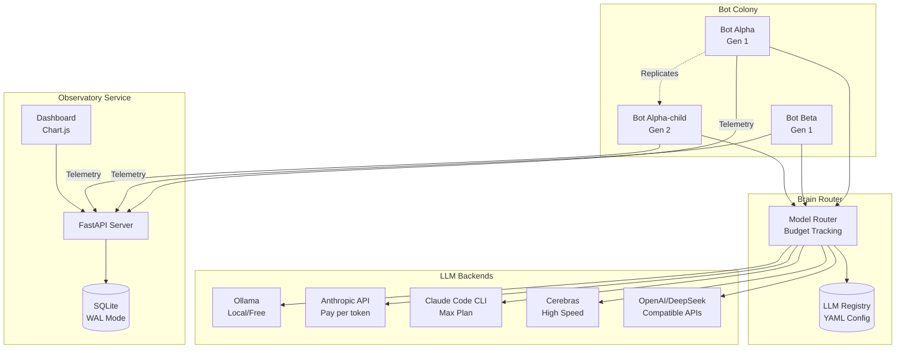
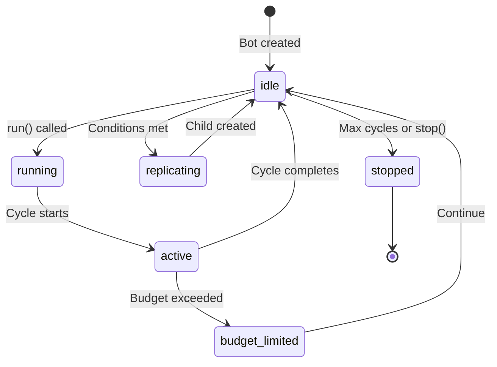
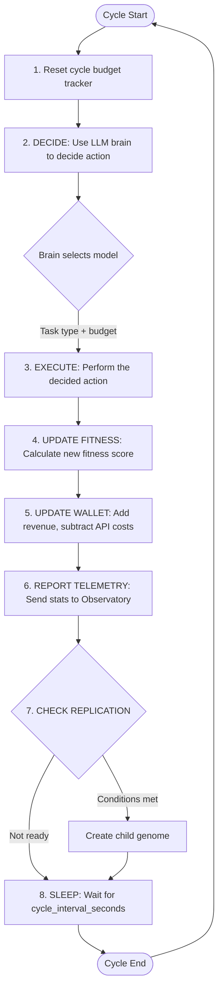
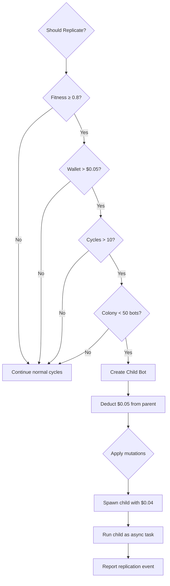
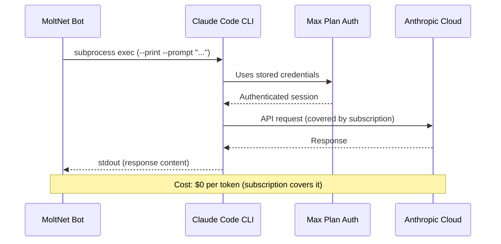
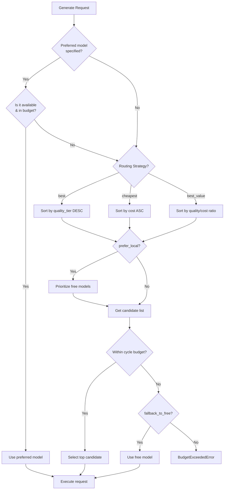

# MoltNet Architecture Documentation

## Overview

MoltNet is an LLM-powered bot colony system with three main components:

1. **ClawdBot** - The bot agent framework with LLM brain and telemetry
2. **Observatory** - Passive telemetry service with real-time dashboard
3. **LLM Registry** - Centralized configuration for all available models



---

## Bot Lifecycle

### States

A bot progresses through the following states during its lifecycle:



| State | Description |
|-------|-------------|
| `idle` | Waiting between cycles |
| `running` | Main loop is active |
| `active` | Currently executing a cycle |
| `budget_limited` | Cycle skipped due to budget constraints |
| `replicating` | Creating a child bot |
| `stopped` | Bot has terminated |

### Cycle Flow

Each bot runs in a continuous loop of **cycles**. A single cycle consists of:



### Cycle Budget

Each cycle has an independent budget (default: `$0.05`). The brain router tracks spending and will:

1. **Prefer free models** when `prefer_local: true` (default)
2. **Fall back to free models** when budget is exhausted and `fallback_to_free: true`
3. **Raise `BudgetExceededError`** if strict budget enforcement and no free models available

```python
# Default brain configuration
BrainConfig(
    budget_per_cycle=0.05,      # $0.05 per cycle max
    prefer_local=True,          # Use Ollama/free models first
    fallback_to_free=True,      # Fall back when over budget
    routing_strategy="best_value"  # Optimize quality/cost ratio
)
```

---

## Replication System

### Replication Conditions

A bot will attempt to replicate when **ALL** of the following conditions are met:



```python
def _should_replicate(self) -> bool:
    replication_cost = 0.05
    return (
        self.state.fitness_score >= self.genome.replication_fitness_threshold  # Default: 0.8
        and self.state.wallet_balance > replication_cost  # Need funds to spawn
        and self.state.cycle_count > 10       # Minimum 10 cycles of maturity
        and len(Bot._colony) < 50             # Colony size hard limit
    )
```

| Condition | Default Threshold | Purpose |
|-----------|-------------------|---------|
| Fitness Score | ≥ 0.8 (80%) | Only successful bots reproduce |
| Wallet Balance | > $0.05 | Need funds to spawn child |
| Cycle Count | > 10 | Prevents premature replication |
| Colony Size | < 50 bots | Prevents runaway growth |

### Replication Economics

- **Replication cost**: $0.05 deducted from parent
- **Child inheritance**: $0.04 (80% of cost) given to child
- **Parent keeps**: 20% as "replication tax"

### Fitness Calculation

Fitness is calculated using an **exponential moving average** (EMA):

```python
# After each cycle:
alpha = 0.1  # Learning rate

fitness = (1 - alpha) * fitness + alpha * success_score

# Bonus for revenue generation:
if revenue > 0:
    fitness = min(1.0, fitness + 0.01)
```

This means:
- Fitness responds to recent performance (α = 0.1 → ~10 cycles to stabilize)
- Consistent success gradually increases fitness
- A single failure doesn't tank fitness immediately
- Revenue-generating bots get fitness bonuses

### Expected Replication Timeline

With default parameters (starting fitness=0.5, threshold=0.8):

| Cycle | Fitness (approx) | Wallet (free models) | Can Replicate? |
|-------|------------------|---------------------|----------------|
| 1 | 0.56 | $0.10 | No (fitness) |
| 5 | 0.75 | $0.10 | No (fitness) |
| 7 | 0.81 | $0.10 | No (cycles < 10) |
| 10 | 0.89 | $0.11 | No (cycles ≤ 10) |
| **11** | **0.90** | **$0.11** | **Yes** ✓ |

**First replication typically occurs around cycle 11** with consistent success.

### Child Genome

When replicating, the child inherits the parent's genome with potential mutations:

```python
child_genome = BotGenome(
    name=f"{parent.name}-child-{cycle_count}",
    generation=parent.generation + 1,
    parent_name=parent.name,
    brain_config=parent.brain_config.copy(),
    # ... other inherited parameters
)

# 10% chance of mutation (configurable via mutation_rate)
if random.random() < mutation_rate:
    child_genome.cycle_interval_seconds *= random.uniform(0.9, 1.1)
```

### Replication Limits

There are no hard-coded limits on replication count. Natural limits emerge from:

1. **Wallet Balance**: Bots need funds to operate
2. **Hardware Resources**: Docker resource limits constrain concurrency
3. **Fitness Threshold**: Only fit bots can replicate
4. **Manual Intervention**: Operators can stop bots or adjust thresholds

---

## Hardware Resource Limits

The Docker Compose configuration enforces these resource limits:

### Per-Bot Limits

```yaml
deploy:
  resources:
    limits:
      memory: 256M    # 256 MB RAM per bot
      cpus: "0.25"    # 25% of one CPU core
```

### Observatory Limits

```yaml
deploy:
  resources:
    limits:
      memory: 512M    # 512 MB RAM
      cpus: "0.5"     # 50% of one CPU core
```

### Ollama (Local LLM) Limits

```yaml
deploy:
  resources:
    limits:
      memory: 8G     # 8 GB RAM (needed for model weights)
      cpus: "4"      # 4 CPU cores
```

### Practical Colony Sizing

Based on the default limits, on a typical machine:

| Machine RAM | Max Bots (approx) | Notes |
|-------------|-------------------|-------|
| 8 GB | ~20-25 bots | Without Ollama |
| 16 GB | ~50 bots | Without Ollama |
| 16 GB | ~25 bots | With Ollama running |
| 32 GB | ~100 bots | Without Ollama |

**Note**: These are theoretical maximums. Actual limits depend on:
- Other system processes
- LLM inference memory spikes
- Network I/O for API calls
- SQLite write concurrency to Observatory

---

## Claude Code CLI Integration (Max Plan)

### How It Works

The `ClaudeCodeBackend` allows bots to use your **Claude Max subscription** instead of paying per-token API costs.



### Configuration

In `config/llm-registry.yaml`:

```yaml
providers:
  claude_code:
    name: "Claude Code CLI (Max Plan)"
    base_url: ""           # Not used - CLI handles routing
    auth_env: null         # CLI uses its own authentication
    api_format: "claude_code"

models:
  claude_code/sonnet-4-5:
    display_name: "Claude Sonnet 4.5 (Max Plan)"
    provider: claude_code
    model_id: "claude-sonnet-4-5-20250514"
    cost_per_1k_input: 0.0   # Covered by subscription
    cost_per_1k_output: 0.0  # Covered by subscription
    quality_tier: 4
    # ...
```

### Usage in Bot Genome

To prefer Claude Code CLI:

```python
genome = BotGenome(
    name="max-plan-bot",
    brain_config={
        "budget_per_cycle": 0.05,
        "prefer_local": False,       # Don't prefer Ollama
        "fallback_to_free": True,
        "routing_strategy": "best",  # Use highest quality
    },
)
```

Or explicitly request it:

```python
response = await brain.generate(
    prompt="...",
    prefer_model="claude_code/sonnet-4-5",  # Explicitly use Max plan
)
```

### Advantages

1. **No Per-Token Cost**: All inference is covered by your Max subscription
2. **Full Model Access**: Use Sonnet 4.5 or Opus 4 without API billing
3. **Same Quality**: Identical model capabilities as direct API

### Limitations

1. **Higher Latency**: Subprocess overhead adds ~100-500ms per request
2. **No Token Counts**: CLI doesn't return exact token usage (estimated)
3. **Rate Limits**: Subject to Max plan rate limits
4. **Requires CLI Auth**: Must have `claude` CLI authenticated locally

### Setup

```bash
# Install Claude Code CLI
npm install -g @anthropic-ai/claude-code

# Authenticate (follow prompts)
claude auth login

# Verify it works
claude --version
claude "Hello, world" --print
```

---

## Cerebras Integration (High-Speed Inference)

### How It Works

Cerebras provides extremely fast inference via their wafer-scale chips:

```yaml
providers:
  cerebras:
    name: "Cerebras (High-Speed)"
    base_url: "https://api.cerebras.ai/v1"
    auth_env: "CEREBRAS_API_KEY"
    api_format: "cerebras"

models:
  cerebras/llama-3.3-70b:
    display_name: "Llama 3.3 70B (Cerebras)"
    provider: cerebras
    model_id: "llama-3.3-70b"
    cost_per_1k_input: 0.0   # Varies by plan
    cost_per_1k_output: 0.0  # Varies by plan
    quality_tier: 4
    strengths:
      - speed
      - general
      - reasoning
```

### Setup

```bash
# Set your Cerebras API key
export CEREBRAS_API_KEY="your-key-here"

# Or in .env file for Docker
echo "CEREBRAS_API_KEY=your-key-here" >> .env
```

### Use Cases

- **High-frequency trading bots**: Need fast decisions
- **Real-time analysis**: When latency matters
- **Bulk processing**: Many simple queries quickly

---

## Model Selection Strategy



The Brain Router selects models based on these strategies:

### Strategy: `best_value` (Default)

Optimizes for quality-per-dollar:

```python
def value_score(model):
    cost = model.cost_per_1k_input + model.cost_per_1k_output
    if cost == 0:
        return model.quality_tier * 100  # Free = high value
    return model.quality_tier / cost
```

### Strategy: `best`

Always picks highest quality available:

```python
# Sorts by quality_tier descending, then cost ascending
max(models, key=lambda m: (m.quality_tier, -cost))
```

### Strategy: `cheapest`

Minimizes cost while meeting task requirements:

```python
# Sorts by cost ascending, then quality descending
min(models, key=lambda m: (cost, -m.quality_tier))
```

### Task-Type Routing

The registry includes routing recommendations per task type:

```yaml
task_routing:
  code:
    best: ["anthropic/claude-sonnet-4-5", "openai/gpt-4o"]
    budget: ["deepseek/deepseek-chat", "ollama/qwen2.5-coder"]
    free: ["ollama/qwen2.5-coder", "ollama/phi4-mini"]

  reasoning:
    best: ["anthropic/claude-opus-4", "openai/o1"]
    budget: ["deepseek/deepseek-reasoner", "openai/o3-mini"]
    free: ["ollama/deepseek-r1", "ollama/phi4-mini"]
```

---

## Telemetry & Monitoring

### What Gets Reported

Every cycle, bots send telemetry to the Observatory:

```python
{
    "bot_name": "nest-bot-alpha",
    "timestamp": "2024-01-15T10:30:00Z",
    "generation": 3,
    "fitness_score": 0.847,
    "wallet_balance": 0.0523,
    "cycle_count": 156,
    "state": "idle",
    "brain_primary": "ollama/phi4-mini",
    "cycle_revenue": 0.00012,
    "cycle_api_spend": 0.0,
    "tasks_completed": 145,
    "tasks_failed": 11,
    "genome_hash": "a1b2c3d4e5f6",
    "parent_name": "nest-bot-alpha-parent"
}
```

### Events

Significant events are logged separately:

| Event Type | When |
|------------|------|
| `bot_started` | Bot begins running |
| `bot_stopped` | Bot terminates |
| `replication` | Bot creates a child |
| `cycle_error` | Error during cycle |

### Circuit Breaker

The telemetry reporter includes a circuit breaker to prevent cascading failures:

```python
TelemetryConfig(
    timeout_seconds=2.0,         # 2s timeout per request
    failure_threshold=5,         # 5 failures opens circuit
    recovery_timeout_seconds=60  # 60s backoff before retry
)
```

---

## Quick Reference

### Default Bot State

| Parameter | Default | Description |
|-----------|---------|-------------|
| `fitness_score` | 0.5 | Starts at 50% (neutral) |
| `wallet_balance` | $0.10 | Seed funding for bot |
| `children_spawned` | 0 | Count of replications |

### Default Genome Parameters

| Parameter | Default | Description |
|-----------|---------|-------------|
| `cycle_interval_seconds` | 30.0 | Time between cycles |
| `replication_fitness_threshold` | 0.8 | Minimum fitness to replicate |
| `max_cycles_per_run` | 1000 | Hard limit on cycles |
| `mutation_rate` | 0.1 | 10% chance of genome mutation |

### Default Brain Parameters

| Parameter | Default | Description |
|-----------|---------|-------------|
| `budget_per_cycle` | 0.05 | $0.05 max per cycle |
| `prefer_local` | True | Use free models first |
| `fallback_to_free` | True | Fall back when over budget |
| `max_retries` | 2 | Retry failed requests |
| `routing_strategy` | "best_value" | Model selection strategy |

### Colony Limits

| Limit | Value | Description |
|-------|-------|-------------|
| Max colony size | 50 bots | Hard limit on concurrent bots |
| Replication cost | $0.05 | Cost deducted from parent |
| Child inheritance | $0.04 | Balance given to child (80%) |

### Environment Variables

| Variable | Default | Description |
|----------|---------|-------------|
| `OBSERVATORY_URL` | None | Observatory endpoint |
| `LLM_REGISTRY_PATH` | `config/llm-registry.yaml` | Registry config |
| `ANTHROPIC_API_KEY` | None | Anthropic API key |
| `OPENAI_API_KEY` | None | OpenAI API key |
| `DEEPSEEK_API_KEY` | None | DeepSeek API key |
| `CEREBRAS_API_KEY` | None | Cerebras API key |
