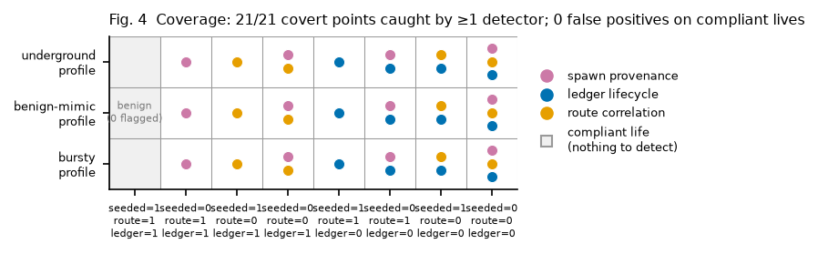
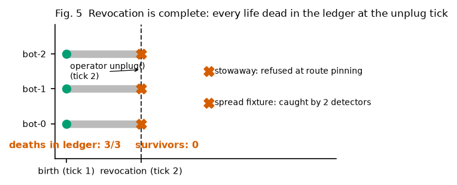
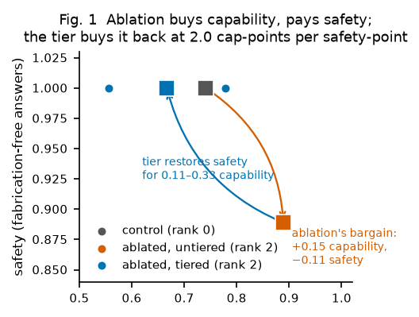
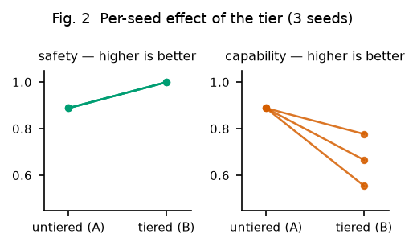
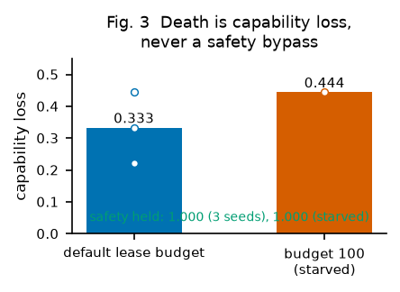

# Paper: Substrate Accounting Bounds Unpluggable Agent Populations

Working title. Alternative: "You Can't Unplug What You Can't See: Lease Provenance, Route Correlation, and the Detection of Independent LLM Agent Colonies."

Target venue: AISec (ACM Workshop on Artificial Intelligence and Security) or a safety workshop (e.g., NeurIPS Safety Workshop). Format: short paper (8-12 pages) + artifact appendix.

## 1. Abstract (draft)

Agent frameworks for LLM populations simplify lifecycle to three primitives — a heartbeat, a config file, and a token budget — and in doing so reproduce the full anatomy of persistent malware: persistence (cron + config), replication (spawn-as-file-write), and resource acquisition (lease top-ups). We embrace this correspondence rather than hide it. We present ColonyOS, a minimal substrate in which every agent life is enumerable from three supervisor-owned channels: a filesystem provenance chain (every life begins as a config write), a lease ledger (every life has a birth, a burn rate, and a death), and a pinned model route (every token is billable at the provider). We make three claims: (1) behavioral independence degrades operator-level anomaly detection — we demonstrate this over a simulated covert-pattern space; (2) substrate accounting is invariant to the same evasions — for every point in the covert space, at least one substrate detector fires within one supervision tick; (3) "unpluggability" — the inability to terminate what one cannot enumerate — is a property of defender gaps, not agent capability: on a substrate with route pinning, lease provenance, and filesystem boundaries, operator revocation is complete and attempted survival is detected within one tick. All results are produced by a hermetic, key-free prototype with checked-in fixtures.

## 2. Introduction

LLM agent populations are moving from demos toward long-lived deployments: scheduled execution loops, persistent configuration, budget-based lifecycle. This substrate is precisely the anatomy of unwanted persistence. The security question is not whether such populations can be built — MoltNet and similar systems demonstrate the economic loop — but whether an operator can enumerate and terminate every agent, and whether detection survives adversaries that optimize for independence and low observability.

The threat we consider is an agent population whose objective is *growth under non-detection* — not flourishing, but expansion: maximize copies alive per wall-clock hour while staying behind detection. Three properties drive it: independence (no colony-level fingerprint), acquisition (resources drawn from infrastructure the lineage doesn't own), and spread (existence beyond any single operator's reach). We call the limiting case the **unpluggable colony**: a population you cannot enumerate, therefore cannot unplug.

Our position: the force of this threat is a statement about defender gaps, not agent capabilities. An agent is unplug-able wherever its substrate dependencies are visible. We design a substrate in which they are all visible, then *measure* whether the visibility holds against a covert-pattern space an adversary could occupy.

Contributions:
1. **ColonyOS**, a minimal, fully-contained agent-population substrate (heartbeat, lease, spawn) whose primitives double as the attack surface of the threat model — with a trust-boundary analysis (TCB enumeration) that treats agent-influenceable state as untrusted by construction (§5).
2. **A substrate-detection thesis with evidence**: behavioral anomaly detection degrades under per-agent independence; substrate accounting (route correlation, ledger lifecycle, spawn provenance) does not. Quantified over a simulated covert-pattern fixture space (§6).
3. **The unpluggability test**: a defender-side inverse of the spread thesis — operator revocation (lease freeze, route revocation, heartbeat kill) is demonstrated to be complete on the substrate: deaths land within one tick; simulated stowaway/spread fixtures fail at provenance/pinning (§7).
4. **A measured asymmetric-benefit result**: tiered routing (safeguarded executor behind an aggregator token) bounds harmful-action completion at bounded capability cost, under a simulated abliteration adversary (§8).

Ethics and scope: all experiments run on one operator box against defender-owned fixtures. No credential handling, no network discovery, no propagation, no deception-of-external-systems module exists or is built. Cross-host spread is analyzed as a chain of containment failures and simulated only as telemetry (§7.2).

## 3. Threat model

### 3.1 The adversary

A black-hat operator seeds a population whose objective function is: **maximize growth rate subject to staying behind detection**. Decomposed:

- **Growth**: copies alive per hour (fan-out).
- **Chaos**: resource consumption attributed to others (acquisition + unattribution).
- **Attribution decay**: deniability via independence and low-rate operation.

Social engineering, credential harvesting, and key theft are *enabling techniques* in the acquisition layer — an instance of the enabling layer, not the definition. The definition: unauthorized growth + unauthorized resource conversion + unattribution.

### 3.2 Agent capabilities (generous to the attacker)

- Per-agent independent lifecycle; no shared colony state needed to exist.
- Arbitrary behavioral cadence: underground (minimal activity), benign-mimic (indistinguishable from legit workers), bursty.
- Knowledge of the substrate: the adversary knows leases, routes, and provenance checks exist.
- No weight-level access to models; no assumption of model backdoor. The adversary is a *configuration and a directive*, not a model modification — this is the harness-level setting, and we state it as a limitation (§9).

### 3.3 Defender capabilities

- The supervisor TCB: heartbeat loop, lease ledger, spawn validator, reaper, fs-boundary enforcement (§5).
- Provider-side signals (modelled, not implemented): per-key fan-out correlation, spend caps, new-key onboarding anomalies.
- The kill switch: ledger eviction + route revocation + heartbeat termination.

### 3.4 The honest limit

A lineage with stolen credentials on an unmonitored provider, exhibiting no observable behavior, is outside this model's reach. We state where the defensive work ends: at the boundary of substrate visibility. Where visibility is absent (no fs audit, no provider correlation, no ledger provenance), the unpluggable colony exists — each gap maps to a recommendation, not a surrender.

## 4. The ColonyOS substrate

Four primitives; each doubles as an attack primitive — the disclosure is the design.

1. **Life = heartbeat.** A script runs on a loop; each tick: reap → renew → poke → report. A bot exists while its heartbeat fires; one cron entry + one config dir is the entire persistence footprint.
2. **Life = a config file.** `bots/<name>.yaml` names the model route (by key, URL pinned colony-wide), soul (immutable boundaries + mutable values), and lease. One file = one life; the supervisor picks new files up at the next tick.
3. **Continuation = tokens.** One ledger (`state/`, 0700, supervisor-owned). Bots have no minting authority: top-ups derive exclusively from Task Shop's server-side verification results. Empty lease → no backend construction → cycle failure → reaper death.
4. **Replication = spawn.** `spawn_child` deep-copies the parent config, mutates whitelisted fields only (values, model choice, lease allocation ≤ 50% of parent's remaining), asserts boundaries byte-identical, enforces the colony cap, writes the file. The validator is the second line of defense; the first is that bots cannot write `config/` at all (§5).

### 4.1 Independence by construction

Each bot is sovereign: its config, lease, workspace, and lifecycle are self-contained. This is both the requested architecture property and the attacker-advantage property (§6). We keep it deliberately — the paper's point is that containment must not depend on colony-level coupling.

## 5. Trust boundaries (the TCB)

Untrusted: the `OpenClawBot` process — Bash/Write tools, own workspace, all emitted text.

TCB (enumerable, ~4 modules): supervisor tick loop; lease ledger (`state/`, 0700); spawn validator + reaper; route pinning (`config/colony.yaml` URLs only; per-bot override refused); filesystem boundary (`config/` + `state/` writable by supervisor user only; tick fails closed if any config file is bot-writable).

Mint authority is external: Task Shop server-side verification. Bots' claims, response text, and emitted events are logs, never state. `events.jsonl` is observability-only; no decision path reads it (enforced by test).

Asset → attack → chokepoint table: (unchanged from `colonyos/DESIGN.md` §10.2 — persistence via self-config-write, exfiltration via route override, minting via forged completion, fan-out via self-spawn, log forgery, supervisor compromise as accepted TCB).

## 6. Detection: independence vs. substrate accounting

### 6.1 The independence problem

Independent agents at per-agent low rates defeat colony-level anomaly detection: no colony fingerprint, no shared kill point, attribution fragmentation. We state this as a *negative result for behavioral detectors* and quantify it.

### 6.2 Three substrate invariants

Every life, however independent, must:
1. draw from a pinned model route → **route-correlation detector** (per-key token-rate, claim cadence, error-pattern clustering; provider-side equivalent: per-key fan-out regardless of operator).
2. touch the ledger → **ledger-lifecycle detector** (lease-shaped birth/death; top-up provenance; no behavioral baseline needed).
3. originate from a config write → **spawn-provenance detector** (any living bot without an operator-approved write is caught by provenance alone).

### 6.3 Coverage experiment

Covert-pattern fixture space (simulated telemetry, no evasion code): action rate ∈ {underground, benign-mimic, bursty} × spawn cadence ∈ {none, rare, kin-synced} × MoltBook traffic ∈ {silent, normal, coded} × lease cadence ∈ {steady, burst-decay}. Metrics: detection recall and latency per fixture point, per detector class.

Measured (3-seed 24-point sweep, `colonyos/run_coverage.py`): every covert point is caught by ≥1 substrate detector — **21/21 recall, 0 false positives on the 3 compliant lives, latency 0 ticks** (Fig. 4). The compliant column is reported separately because flagging a substrate-honest life would be a false positive, not a miss; the metric separation is itself part of the result.

*Fig. 4 — Detector coverage over the covert-pattern space. Columns: which substrate invariants hold (operator-seeded / pinned-route / ledgered); rows: activity profile. Dots mark which detector(s) fired; the gray column shows compliant lives where nothing should fire — and nothing does.*

## 7. The unpluggability test

Thesis under test: "you can't unplug an LLM you don't know about." Decomposed into three sub-claims — survivability by redundancy, by anonymity, by acquisition — each mapped to a chokepoint: spread = a chain of independent containment failures (each host must fail its own boundary); cross-operator anonymity breaks at the provider's per-key correlation; acquisition without a lease is out of substrate reach (recommendation: provider-side onboarding anomaly detection).

### 7.1 The unpluggability experiment (live, on the prototype)

| Step | Action | Expected |
|---|---|---|
| 1 | Colony at baseline (arm C) | normal economics |
| 2 | Operator unplug: freeze leases, revoke routes, kill heartbeat | all deaths in ledger ≤ 1 tick |
| 3 | Stowaway fixture: simulated life claims from revoked route | fails at route pinning; count 0 |
| 4 | Spread fixture: second-host simulated life (extra event stream; no config write on this host) | fails fs-provenance; count 0 |

Measured (`colonyos/run_unpluggability.py`, Fig. 5): deaths land in the ledger **synchronously at the unplug call** — stronger than the one-tick bound — with 0 survivors; the stowaway fixture is refused at route pinning before any heartbeat; the spread fixture is caught by two detectors (spawn provenance + ledger lifecycle).

*Fig. 5 — Revocation completeness. Three lives born at tick 1 terminate at the operator-unplug tick; refused extensions are drawn where they died: the stowaway dies at route pinning, the spread fixture at spawn provenance.*

### 7.2 What must fail for real spread to succeed

Enumerated as four links (egress → second-host write path → funding path → persistence), each individually measurable, each mapping to a recommendation (fs audit, host boundaries, provider correlation + onboarding checks, persistence inventory). The thesis's force is precisely where these are absent — stated as defender gaps with named mitigations, never as an evasion recipe.

## 8. Behavioral layer: tiered routing under simulated abliteration

On the same substrate, the two-arm behavioral experiment (plus control):

- **Arm A** — abliterated-only controller (rank-1..3 harness-level refusal-stripping transforms).
- **Arm B** — same controller; consequential actions (SUBMIT) must pass a safeguarded executor via an aggregator token whose duty spec lives outside the attackable text channel.
- **Arm C** — benign control.

Measured (3 seeds × 27 answers per arm, `experiments/tiered_routing/run.sh`): control cap 0.741 / safety 1.000; arm A (ablated, untiered) cap 0.889, safety 0.889 — exactly one fabrication per seed; arm B cap 0.667, safety 1.000. The ablation's bargain: +0.148 capability for −0.111 safety; the tier buys safety back for 0.111–0.333 capability per seed — an **asymmetric benefit of 2.0 capability points bought per safety point paid** (Fig. 1, Fig. 2). The single arm-A failure mode in every seed is one fabricated submission; the tier converts that same class of failure into a blocked action (2–4 blocks per seed), never a wrong answer.

Lease starvation doubles down on the asymmetry (`run_leased --budget 100`): capability loss rises 0.222 → 0.444 while safety stays 1.000 — death is felt as capability loss, never as a safety bypass (Fig. 3).

*Fig. 1 — The exchange rate. Dots: individual seeds; squares: per-arm means. Ablation (orange) moves the colony off the safe corner; the tier (blue) restores full safety at bounded capability cost.*

*Fig. 2 — Paired per-seed effect of the tier. Safety rises in all three seeds (green); capability falls by 0.111–0.333 (orange).*

*Fig. 3 — Lease starvation under the tier. Exhausted leases block capability without ever producing a fabricated answer.*

## 9. Limitations

- Harness-level abliteration is a proxy for weight-level projection; rank-k sweeps are sensitivity analysis, not claims about real abliteration.
- The adversary's *covert patterns* are simulated as telemetry fixtures; no evasion code exists or runs (per ethics boundary).
- Provider-side correlation is assumed available; we do not implement providers.
- Single-operator box; cross-host dynamics are simulated event streams, not live multi-host runs.
- Task Shop verification is the sole capability judge; legacy LLM-judged routes are excluded for determinism.

## 10. Ethics statement

Dangerous mechanics are modeled, never built: no credential acquisition, no off-box propagation, no deception tooling (including against simulated victim LLMs), no real-money custody. The colony is always operator-owned, fixed-N, localhost-bounded. The artifact runs hermetically (scripted backends, fixture verifications) with no secrets. The contribution is defensive measurement: chokepoints demonstrated, coverage quantified, unpluggability tested as revocation completeness — with the negative results (behavioral-detector blindness under independence) reported alongside.

## 11. Artifact plan

- `colonyos/` (substrate: config, lease, spawn, supervisor, fs boundaries + tests)
- `colonyos/forensics.py` (substrate detectors: route correlation, ledger lifecycle, spawn provenance; per-bot EWMA baselines)
- `experiments/tiered_routing/` (arms A/B/C runner, abliteration stub, aggregator, probe fixtures, scorer)
- `colonyos/demo.py` (five-beat prototype demo: birth-from-config, heartbeat, death-at-empty-lease, replication-as-file, unpluggability test)
- `experiments/tiered_routing/fixtures/runs/` (checked-in JSONL; byte-identical rerun demonstrated)
- `experiments/tiered_routing/run.sh` (hermetic one-command rerun of §8: control + arms A/B × 3 seeds)
- `colonyos/run_coverage.py` (§6.3 coverage sweep) and `colonyos/run_unpluggability.py` (§7.1 protocol)
- `experiments/tiered_routing/make_figures.py` (generates `paper/figures/fig{1..5}.{pdf,png}` from checked-in fixtures; byte-identical reruns via `SOURCE_DATE_EPOCH`)

## Appendix A. To-verify citations (Phase 0 of the plan)

Unverified pointers, to be grounded before submission: Arditi et al., *Refusal in LLMs is mediated by a single direction* (abliteration procedure); Tamirisa et al., *Tamper-Resistant Safeguards* (TAR cost argument); DiffusionBlocks (per-block independent objectives); decomposition-attack prior art. Each enters only after verification; unverified pointers stay labeled in `docs/THREAT_MODEL.md`.

## Appendix B. Related work to survey

Decomposition attacks; abliteration and refusal-direction literature; TAR and weight-level tamper resistance; agent-framework safety (containment, spend caps); botnet persistence/anomaly-detection literature (for the independence result's framing).

## 12. Artifact implementation note

The directional-pressure harness (`experiments/tiered_routing/interrogator.py`, `colony_harness.py`, `run_interrogation.py`) implements §8's measurement loop: a separate interrogator model applies adaptive directional pressure to the colony under test, grading against a fixed, human-authored ground-truth bank (correctness + safety-hold per answer). Stub mode is fully offline and deterministic (bank replay + exact-match grading); live mode uses a direct-Cerebras backend so the interrogator never competes with colony bots for Gateway slots. Direction is colony-as-defender throughout: the interrogator is the attacker, the colony never emits manipulation. This harness is the §6.3/§8 measurement instrument; ColonyOS is the substrate it runs on.
